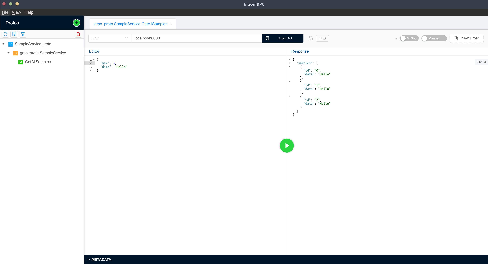

# ProtocolBuffer 를 이용한 GRPC 서버 구현

# 0. 사전준비
- golang 설치 (https://go.dev/doc/install)
- Protocol Buffer 설치
- BloomRPC 설치(테스트도구:https://github.com/bloomrpc/bloomrpc)

# 1. 프로젝트 생성
- go mod init [moduleName] 을 이용해 프로젝트를 생성합니다.
```shell
❯ go mod init potato/demo-protocolbuffer-grpc
```

- 필요한 라이브러리를 설치 합니다.
```shell
❯ go get -u github.com/golang/protobuf/protoc-gen-go
❯ go get -u google.golang.org/grpc
```

- 라이브러리가 설치 되었다면 다음과 같습니다.
```go
module potato/demo-protocolbuffer-grpc

go 1.17

require (
        github.com/golang/protobuf v1.5.2 // indirect
        golang.org/x/net v0.0.0-20220127200216-cd36cc0744dd // indirect
        golang.org/x/sys v0.0.0-20220209214540-3681064d5158 // indirect
        golang.org/x/text v0.3.7 // indirect
        google.golang.org/genproto v0.0.0-20220215190005-e57b466719ef // indirect
        google.golang.org/grpc v1.44.0 // indirect
        google.golang.org/protobuf v1.27.1 // indirect
)
```

# 2. Protocol Buffer를 이용한 rpc 인터페이스를 정의
- proto/sampleService.proto 파일을 만듭니다.
```protobuf
syntax = "proto3";

package grpc_proto;
option go_package = "potato/demo-protocolbuffer-grpc/grpc";

service SampleService{
  rpc GetAllSamples(GetAllSamplesRequest) returns (GetAllSamplesResponse){

  }
}

message Sample {
  int32 id = 1;
  string data = 2;
}

message GetAllSamplesRequest {
  int32  max = 1;
  string data = 2;
}

message GetAllSamplesResponse {
  repeated grpc_proto.Sample samples = 1;
}
```

- grpc디렉토리를 생성하고 프로젝트 root에서 다음 명령을 통해 .proto 파일을 빌드합니다. 빌드 결과는 go 파일로 저장됩니다.
- --go-grpc_opt=require_unimplemented_servers=false 옵션을 
```shell
❯ mkdir grpc
❯ protoc --go_out=./grpc --go_opt=paths=source_relative --go-grpc_out=./grpc --go-grpc_opt=paths=source_relative --go-grpc_opt=require_unimplemented_servers=false `find proto/ -name "*.proto"`
❯ ls -al grpc/proto
total 24
drwxrwxr-x 2 potato potato 4096 Feb 17 01:02 .
drwxrwxr-x 3 potato potato 4096 Feb 17 01:02 ..
-rw-rw-r-- 1 potato potato 3773 Feb 17 01:02 sampleSerivce_grpc.pb.go
-rw-rw-r-- 1 potato potato 9919 Feb 17 01:02 sampleSerivce.pb.go

```
- _grpc.pb.go 는 rpc 서버와 클라이언트에서 실제 구현체와 연결할 Interface를 정의 합니다.
- pb.go는 메시지 및 서비스를 정의 하고 있습니다.


# 3. 2에서 ProtocolBuffer 를 구현
- 가장 먼저 구현해야할 부분은 역시 구현체입니다.
- logic/sampleService.go 를 생성합니다.
```go
package logic

import (
	"context"
	"log"
	pb "potato/demo-protocolbuffer-grpc/grpc/proto"
)

type Service struct {
}

func (s Service) GetAllSamples(ctx context.Context, request *pb.GetAllSamplesRequest) (*pb.GetAllSamplesResponse, error) {
	log.Println(request)
	samples := make([]*pb.Sample, request.Max)
	for index := 0; int32(index) < request.Max; index++ {
		samples[index] = &pb.Sample{
			Id:   int32(index),
			Data: request.Data,
		}
	}

	return &pb.GetAllSamplesResponse{
		Samples: samples,
	}, nil
}
```
- 간단한 로직입니다. request로 인입된 숫자 만큼 Data를 반복해서 반환합니다.
- GetAllSamples는 ProtocolBuffer 빌드 시점에 이미 정의 되어있습니다.(sampleService_grpc.pb.go)

# 4. RPC 서버 생성 및 Logic 연결
- server/main.go 파일을 생성합니다.
```go
package main

import (
	"google.golang.org/grpc"
	"log"
	"net"
	pb "potato/demo-protocolbuffer-grpc/grpc/proto"
	"potato/demo-protocolbuffer-grpc/logic"
)

func main() {
	s := grpc.NewServer()
	if listen, err := net.Listen("tcp", ":8000"); err != nil {
		log.Fatalf("fail to listen: %v", err)
	} else {
		pb.RegisterSampleServiceServer(s, logic.Service{})
		err := s.Serve(listen)
		if err != nil {
			log.Fatalf("Fail to start service")
		}
	}
}
```
- 코드는 간단합니다. 8000번 포트로 rpc 서버를 생성하고 좀전에 만들어 놓은 logic.Service를 등록합니다.


# 5. 빌드/실행/테스트
- BllomRPC에 처음에 만든 sampleService.proto 를 추가하고 테스트를 수행하면 됩니다.

- 빌드/실행 
```go
❯ go build server/main.go
❯ ./main
```

- BloomRPC 실행 후 좌측 " + " 메뉴를 클릭한 후 sampleService.proto 선택 
- RPC 서버 주소 및 포트를 입력 후 테스트 
